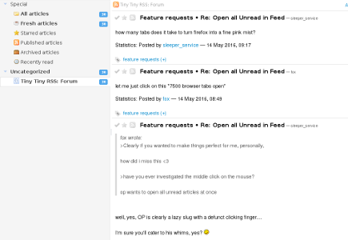

# Tiny Tiny RSS
_web-based news feed reader and aggregator_

https://tt-rss.org/

Tiny Tiny RSS is an open source web-based news feed (RSS/Atom) reader and aggregator, 
designed to allow you to read news from any location, while feeling as close to a real desktop application as possible.

Default username: admin, password: password.

